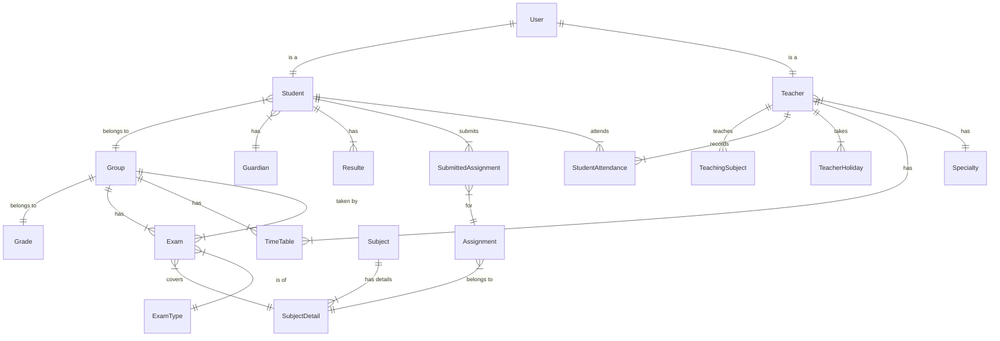
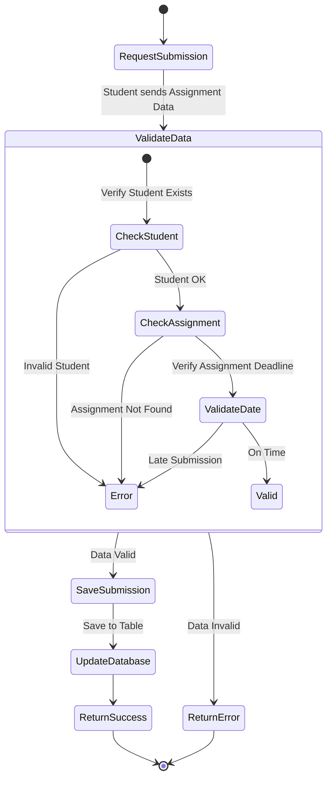

# Diagrams

## ER Diagram (Entity Relationship Diagram)

```mermaid
erDiagram
    User ||--|| Student : "is a"
    User ||--|| Teacher : "is a"

    Student }|--|| Group : "belongs to"
    Student }|--|| Guardian : "has"
    Student ||--|{ Resulte : "has"
    Student ||--|{ SubmittedAssignment : "submits"
    Student ||--|{ StudentAttendance : "attends"

    Teacher ||--|{ TeachingSubject : "teaches"
    Teacher ||--|{ StudentAttendance : "records"
    Teacher ||--|{ TeacherHoliday : "takes"
    Teacher ||--|{ TimeTable : "has"
    Teacher }|--|| Specialty : "has"

    Group ||--|| Grade : "belongs to"
    Group ||--|{ Exam : "has"
    Group ||--|{ TimeTable : "has"

    Exam }|--|| SubjectDetail : "covers"
    Exam }|--|| ExamType : "is of"
    Exam }|--|| Group : "taken by"

    Subject ||--|{ SubjectDetail : "has details"

    Assignment }|--|| SubjectDetail : "belongs to"
    SubmittedAssignment }|--|| Assignment : "for"
```

## Activity Diagram: Submit Assignment

```mermaid
stateDiagram-v2
    [*] --> RequestSubmission
    RequestSubmission --> ValidateData: Student sends Assignment Data

    state ValidateData {
        [*] --> CheckStudent: Verify Student Exists
        CheckStudent --> CheckAssignment: Student OK
        CheckStudent --> Error: Invalid Student

        CheckAssignment --> ValidateDate: Verify Assignment Deadline
        CheckAssignment --> Error: Assignment Not Found

        ValidateDate --> Valid: On Time
        ValidateDate --> Error: Late Submission
    }

    ValidateData --> SaveSubmission: Data Valid
    ValidateData --> ReturnError: Data Invalid

    SaveSubmission --> UpdateDatabase: Save to Table
    UpdateDatabase --> ReturnSuccess

    ReturnSuccess --> [*]
    ReturnError --> [*]
```
